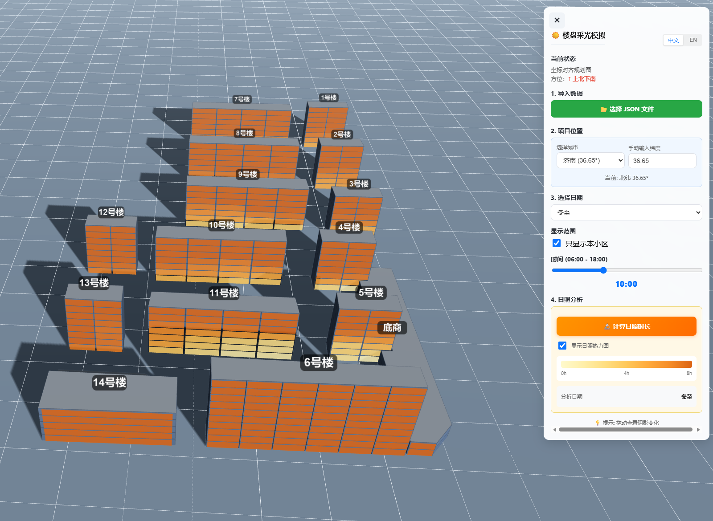
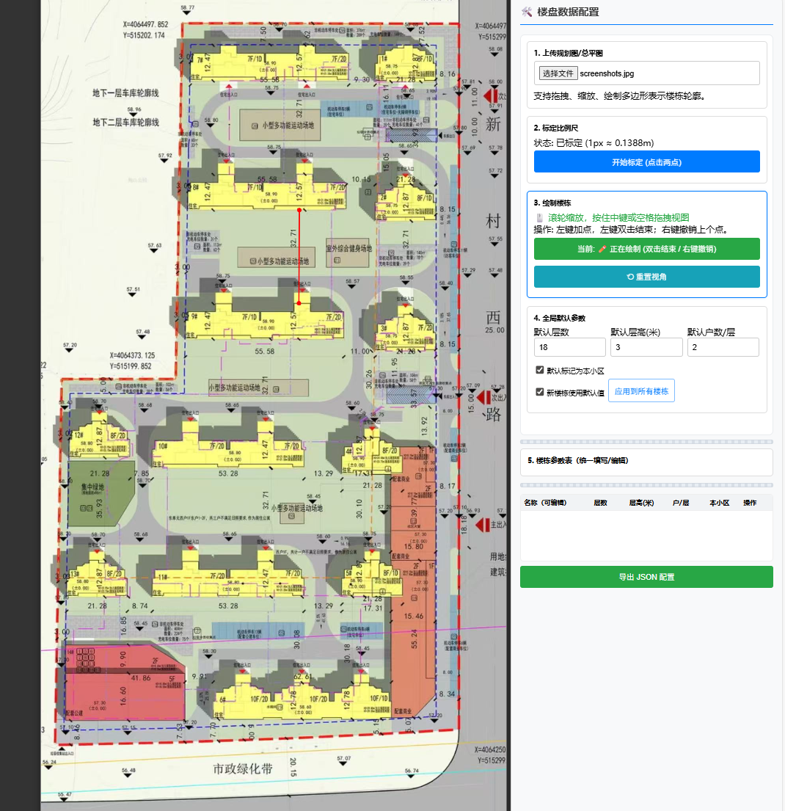

<p align="center">
  <span>English</span> | <a href="./README.md">简体中文</a>
</p>

<div align="center">

# 🏢 Building Sunlight Simulator

**Lightweight 3D Sunlight Analysis Tool for Building Planning**

<p>
    <a href="https://github.com/ruanyf/weekly/blob/master/docs/issue-382.md">
        
    </a>
  <a href="https://opensource.org/licenses/MIT">
    
  </a>
  <a href="https://threejs.org/">
    
  </a>
  <a href="https://github.com/seanwong17/building-sunlight-simulator/pulls">
    
  </a>
</p>

<h3>
  👉 <a href="https://seanwong17.github.io/building-sunlight-simulator/">Click for Live Demo</a> 👈
</h3>

<p style="font-size: 13px; color: #666;">
  Note: The live demo shows default sample data. To use your own floor plans, please refer to the "Local Usage" section below.
</p>



</div>

---

## 📋 Introduction

**Building Sunlight Simulator** is a web-based tool for architectural planning and sunlight simulation.

It allows users to draw building outlines directly over a floor plan image (JPG/PNG) in the browser, instantly generating a 3D scene. By combining precise geographical coordinates with solar trajectory algorithms, it performs accurate sunlight and shadow analysis for target buildings. The project is purely frontend-based, has no backend dependencies, and supports offline usage.

---

## ✨ Core Features

| Module | Description |
|--------|-------------|
| **Deployment** | Pure static HTML/CSS/JS. Download and run, no environment installation required. |
| **Editor** | Converts 2D plans to 3D models. Supports outline drawing, floor height settings, and scale calibration. |
| **Calculation** | Uses spherical trigonometry for solar paths. Built-in latitude data for 50+ major cities. |
| **Visuals** | High-precision 4096px shadow maps. Real-time adjustments for Winter/Summer Solstice & Equinoxes (06:00-18:00). |
| **Interaction** | Supports PC mouse and mobile touch controls. Features filtering for non-target buildings. |

---

## 🚀 Quick Start

The project consists of two core files: `editor.html` (Data Producer) and `index.html` (Data Consumer/Viewer).

### 1. Get the Project
```bash
git clone [https://github.com/seanwong17/building-sunlight-simulator.git](https://github.com/seanwong17/building-sunlight-simulator.git)
# Or download the ZIP directly
```

### 2. How to Run
No build tools are required. Choose one of the following methods:

* **Direct Open**: Double-click `editor.html` or `index.html` in your file explorer to run in the browser.
* **Local Server (Recommended)**: For hot-reloading or to avoid local file CORS restrictions, use `live-server` or `python -m http.server`.

---

## 📖 Usage Workflow

Flow: **Plan Configuration (Editor)** ➜ **Export JSON** ➜ **Sunlight Analysis (Viewer)**

### Step 1: Create Data (editor.html)
Open `editor.html` to convert your 2D floor plan into the JSON data required for 3D simulation.

1.  **Upload Map**: Upload a JPG/PNG image of the site plan or floor plan.
2.  **Calibrate Scale**: Pick two points on the map with a known distance (e.g., a scale bar) and input the actual distance in meters.
3.  **Draw Buildings**: Left-click to plot points; double-click to close the shape and generate the outline.
4.  **Set Properties**: Select a building to set the number of floors, floor height, and geographical location.
5.  **Export Config**: Click save to generate the configuration file (defaults to `data.json`).

<details>
<summary>📌 Editor Shortcuts</summary>

| Action | Shortcut |
|--------|----------|
| Zoom View | Mouse Wheel |
| Pan Canvas | Middle Mouse Button / Space + Left Click |
| Undo Point | Right Click |
| Complete Shape | Double Left Click |

</details>



### Step 2: Simulate (index.html)
Open `index.html` for 3D visualization and analysis.

1.  **Import Data**: Click the button to load the JSON file exported in Step 1 (or use `examples/sample.json` in the repo for testing).
2.  **Adjust Environment**: Select a preset city or manually enter latitude; switch dates (Winter/Summer Solstice).
3.  **Observe Shadows**: Drag the time slider to observe sunlight occlusion on the target floors throughout the day.

---

## 📐 Data Protocol

The project uses JSON to transfer building data. `examples/sample.json` provides a complete example.

<details>
<summary>Click to view JSON Structure</summary>

```jsonc
{
  "version": 1.7,                  // Data version
  "latitude": 36.65,               // Latitude (Effects solar elevation)
  "scaleRatio": 0.483,             // Scale: 1 pixel = N meters
  "origin": { "x": 306, "y": 336 },// Coordinate system origin (pixels)
  "buildings": [
    {
      "name": "Building 1",
      "floors": 18,                // Number of floors
      "floorHeight": 3,            // Height per floor (meters)
      "totalHeight": 54,           // Total height (Optional, auto-calculated)
      "isThisCommunity": true,     // Is target community (For highlighting/filtering)
      "shape": [                   // Vertex coordinates (Meters relative to origin)
        { "x": -19.18, "y": -107.28 },
        { "x": -19.18, "y": -115.55 },
        { "x": 2.51, "y": -115.31 }
      ],
      "center": { "x": -8.36, "y": -111.45 }
    }
  ]
}
```

</details>

---

## 🛠️ Tech Implementation

* **Engine**: Three.js (WebGL)
* **Shadows**: PCFSoftShadowMap
* **Solar Algorithm**:
    * Solar Elevation: $\sin(h) = \sin(\phi)\sin(\delta) + \cos(\phi)\cos(\delta)\cos(\omega)$
    * Solar Azimuth: $\cos(A) = (\sin(h)\sin(\phi) - \sin(\delta)) / (\cos(h)\cos(\phi))$

---

## 🤝 Contribution

Issues and Pull Requests are welcome!

* **Issues**: [Bug reports & Feature requests](https://github.com/seanwong17/building-sunlight-simulator/issues)
* **TODOs**: Custom date picker, Sunlight duration statistics export, DXF import support.

---

## 📄 License

[MIT License](LICENSE) © 2023 seanwong17

---

## 📈 Star History

[](https://star-history.com/#SeanWong17/building-sunlight-simulator&Date)

---

<div align="center">
  <br>
  Made with ❤️ by <a href="https://github.com/seanwong17">seanwong17</a>
</div>